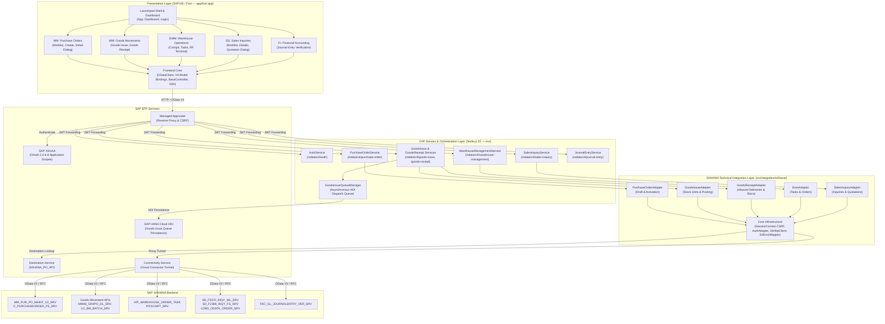

# SAP S/4HANA Enterprise Full-Stack Platform

[](https://nodejs.org)
[](https://cap.cloud.sap)
[](https://ui5.sap.com)
[](https://sap.github.io/cloud-sdk/)
[](https://help.sap.com/docs/BTP)
[](.github/workflows/ci.yml)
[-success.svg)](#testing)
[](#testing)
[](#testing)

An enterprise-grade, full-stack business operations platform integrating **SAP Fiori (SAPUI5)** with **SAP S/4HANA (Cloud / On-Premise)** through the **SAP Cloud Application Programming Model (CAP)** and **SAP Business Technology Platform (BTP)**.

The solution delivers a unified, resilient multi-module enterprise workspace spanning:
- **Materials Management (MM)**: Two-phase Purchase Order creation, draft activation, dynamic calculations, and real-time catalog value helps.
- **Warehouse Management (WM)**: Reservation-driven and ad-hoc Goods Issue with batch SLED tracking, storage unit / GS1 barcode parsing, HDI-backed resilient dispatch queue, and multi-tier Goods Receipt inbound delivery processing.
- **Extended Warehouse Management (EWM)**: Real-time Warehouse Cockpit KPI dashboard, two-step warehouse task management, and scanner-optimized RF Terminal emulation.
- **Sales & Distribution (SD)**: Sales Inquiry worklists with KPI metrics, partner/commercial factsheets, and dialog-driven quotation generation.
- **Financial Accounting (FI)**: General Ledger journal entry verification, line item debit/credit analysis, and balance validation.

---

## Architecture

The platform implements a strict separation of concerns across presentation, CAP domain orchestration, S/4HANA integration, and BTP backing services:



### Architectural Principles

1. **Strict Separation of Concerns**:
   - `app/fiori-app/`: SAPUI5 presentation layer, XML views, view models, and UI event controllers. Never handles raw credentials, S/4 technical mapping, or direct persistence.
   - `srv/`: Authoritative CAP domain logic, business validation, user identity resolution (`req.user`), and workflow orchestration.
   - `srv/integration/s4hana/`: Exclusive boundary for S/4HANA technical Gateway communication, OData V2 payload shaping, `/Date(...)/` timestamp conversion, and RFC error mapping.
2. **Stateless Request Isolation (`SessionContext`)**:
   - CSRF tokens and HTTP cookies are encapsulated within per-request contexts. This eliminates cross-session credential pollution and token invalidation under high concurrent loads.
3. **Resilient Asynchronous Queueing**:
   - High-throughput Goods Issue transactions utilize an in-memory / HANA HDI container dispatch queue (`saps4hana.wm.GoodsIssueQueue`) with automatic retry policies and idempotency guards, ensuring zero data loss during transient S/4 Gateway outages.
4. **Authoritative Multi-Tier Validation**:
   - *Tier 1 (UI)*: Immediate client-side format checks and required field validation.
   - *Tier 2 (CAP Domain)*: Authoritative business invariant validation prior to ERP communication.
   - *Tier 3 (S/4HANA)*: Backend ERP accounting, release strategy, and posting locks.
5. **Internationalization Parity**:
   - Default and English i18n bundles maintain **100% key-for-key parity** across 800 keys, with zero hard-coded UI strings.

---

## Features Matrix

### 1. Materials Management (MM) — Purchase Orders
- **Interactive Creation Workspace**: Responsive SAPUI5 form with organizational, commercial, and delivery parameters.
- **Dynamic Line Items**: Real-time gross and net value calculation, multi-currency support, and standard 10-increment item numbering (`10`, `20`, `30`...).
- **Comprehensive Value Helps**: Live search dialogs querying SAP Gateway (`C_PURCHASEORDER_FS_SRV`) for Suppliers, Plants, Storage Locations, Materials, Purchasing Organizations, Purchasing Groups, Incoterms, and Payment Terms.
- **Two-Phase Commit**: Creates draft headers (`C_PurchaseOrderTP`) and items against `MM_PUR_PO_MAINT_V2_SRV`, followed by explicit draft activation (`ActivateDraftPurchaseOrder`).

### 2. Warehouse Management (WM) — Goods Movements
- **Goods Issue**:
  - Reservation-driven and direct posting with real-time stock and batch validation.
  - Expiry date (SLED) status indicators (Valid, Expiring Soon, Expired).
  - Storage unit and GS1-128 barcode parsing (handling ASCII 29 group separators).
  - Background dispatch queue with retry policies and HANA HDI persistence (`saps4hana-db`).
- **Goods Receipt**:
  - Inbound delivery worklist with supplier, carrier, and line item tracking.
  - Multi-tier barcode scanner resolution: scans Delivery Number, Purchase Order (`PoHelpSet`), or Batch (`LO_BM_BATCH_SRV`), resolving plant and storage locations automatically.
  - Direct Goods Movement posting with real-time feedback.

### 3. Extended Warehouse Management (EWM) — Warehouse Cockpit
- **Warehouse Cockpit**:
  - Live KPI tiles: Open Tasks, Pending Confirmations, Unassigned Tasks, and Error Queue.
  - Tabbed operational monitors: Task Queue, Warehouse/Storage Types, Storage Bins, and Resource Allocations.
- **Warehouse Tasks**:
  - Two-step creation flow for putaway, picking, and internal movements.
  - Execution, status tracking, cancellation, and confirmation against SAP S/4HANA backend.
- **RF Terminal Emulation**:
  - Scanner-optimized, touch-friendly UI for warehouse operators.
  - Barcode scanning simulation with visual and audio cues.
  - Resource and work queue switching.

### 4. Sales & Distribution (SD) — Sales Inquiries
- **Sales Inquiry Worklist**:
  - Real-time worklist with analytics KPI cards (`SD_F2370_INQY_WL_SRV`).
  - Search and filtering across sales organizations, channels, divisions, and customers.
- **Inquiry Details & Partner Factsheets**:
  - Deep factsheet navigation displaying sold-to, ship-to, payer, and bill-to parties (`SD_F2369_INQY_FS_SRV`).
  - Item pricing conditions and schedule line tracking.
- **Quotation Generation**:
  - Modal dialog to create quotations directly referencing sales inquiry line items (`LORD_ODATA_ORDER_SRV`).
  - Validity date controls and condition value adjustments.

### 5. Financial Accounting (FI) — Journal Entries
- **Journal Entry Verification**:
  - Direct verification of financial accounting documents (`FAC_GL_JOURNALENTRY_VER_SRV`).
  - Line item debit/credit analysis (`S` / `H`), posting keys, company codes, and fiscal year tracking.
  - Balance validation and journal entry status reporting.

### 6. Cross-Platform Core Capabilities
- **Unified SAP Error Model**: Translates complex Gateway XML/JSON errors into standard RFC HTTP statuses (`400`, `401`, `403`, `404`, `409`, `422`, `500`, `502`, `503`).
- **XSUAA Identity Derivation**: Derives requisitioner identity from authenticated JWT credentials (`req.user.id`), with safe local development fallbacks.
- **Full CI/CD Automation**: GitHub Actions pipeline validating dependencies, root ESLint, UI5 linting, test suites, UI5 preload build, and MTA deployment descriptors on every push and pull request.

---

## Technology Stack

| Layer | Technology / Library | Version | Purpose |
| :--- | :--- | :--- | :--- |
| **Runtime Environment** | Node.js | `>=22.0.0` (v22 LTS) | High-performance JavaScript runtime |
| **Frontend Framework** | SAPUI5 | `1.136.0` (Pinned) | Enterprise Fiori UX and control library |
| **Frontend Tooling** | `@ui5/cli`, `@ui5/linter` | `4.x` / `1.x` | UI5 local server, build packaging, and static analysis |
| **Backend Framework** | SAP CAP | `@sap/cds` v10 | OData V4 service model, routing, and domain logic |
| **SAP Integration** | SAP Cloud SDK | `v4.x` | BTP Destination lookup and HTTP execution |
| **Code Quality** | ESLint | `10.x` (Flat Config) | Backend static code analysis and syntax enforcement |
| **Cloud Persistence** | SAP HANA Cloud / `@cap-js/hana` | `v3.x` | HDI container for Goods Issue queue (`saps4hana-db`) |
| **Local Persistence** | `@cap-js/sqlite` | `3.x` | Lightweight local in-memory SQLite database |
| **Security & Auth** | SAP XSUAA (`@sap/xssec`, Approuter) | Dedicated | OAuth 2.0 JWT validation, RBAC, and route guards |
| **Deployment / MTA** | Cloud MTA Build Tool (`mbt`) | `1.2+` | Multi-Target Application archive packaging for Cloud Foundry |
| **Test Automation** | Jest, `@cap-js/cds-test`, Supertest | `30.x` / `1.x` | Comprehensive Unit, Integration, and E2E automation |

---

## Security & Role-Based Access Control (RBAC)

The application enforces fine-grained authorization via **SAP BTP XSUAA** (`xs-security.json`) and CAP `@requires` service annotations across **8 distinct application roles**:

| Role Name | Role Collection Name | Scope Identifier | Permitted Operations & Domain Access |
| :--- | :--- | :--- | :--- |
| **`Viewer`** | `SAPS4HANA_Viewer` | `$XSAPPNAME.Viewer` | Read-only access across all business modules: Purchase Orders, Value Helps, Goods Movements, Warehouse Tasks, Sales Inquiries, and Journal Entries. |
| **`Admin`** | `SAPS4HANA_Admin` | `$XSAPPNAME.Admin` | Full administrative access to all modules, including document creation, postings, task cancellations, and configuration. |
| **`PurchasingManager`** | `SAPS4HANA_PurchasingManager` | `$XSAPPNAME.PurchasingManager` | Materials Management: Create draft Purchase Orders, maintain line items, activate documents in S/4, and manage procurement workflows. |
| **`FinanceViewer`** | `SAPS4HANA_FinanceViewer` | `$XSAPPNAME.FinanceViewer` | Financial Accounting: View general ledger journal entries, line item debits/credits, and balance verification data. |
| **`SalesRepresentative`**| `SAPS4HANA_SalesRepresentative`| `$XSAPPNAME.SalesRepresentative`| Sales & Distribution: Create Sales Inquiries, configure inquiry parameters, and generate Sales Quotations. |
| **`SalesManager`** | `SAPS4HANA_SalesManager` | `$XSAPPNAME.SalesManager` | Sales & Distribution: Manage and approve Sales Inquiries and Sales Quotations across sales organizations. |
| **`WarehouseClerk`** | `SAPS4HANA_WarehouseClerk` | `$XSAPPNAME.WarehouseClerk` | Warehouse Management: Post Goods Issue, confirm Goods Receipt inbound deliveries, execute warehouse tasks, and operate RF Terminal. |
| **`WarehouseManager`** | `SAPS4HANA_WarehouseManager`| `$XSAPPNAME.WarehouseManager`| Extended Warehouse Management: Warehouse Cockpit monitoring, resource management, task dispatching, and queue exception handling. |

---

## Local Development

### 1. Prerequisites

Ensure the following runtimes and tools are installed:
1. **Node.js**: `v22.x` LTS (`node --version`)
2. **npm**: `v10.x` or higher (`npm --version`)
3. **SAP CAP Development Kit**:
   ```bash
   npm install -g @sap/cds-dk
   cds --version
   ```
4. **SAP UI5 CLI**:
   ```bash
   npm install -g @ui5/cli
   ui5 --version
   ```
5. **Cloud MTA Build Tool (`mbt`)**:
   ```bash
   npm install -g mbt
   mbt --version
   ```
6. **Cloud Foundry CLI**: `cf` version 8 or higher with the multiapps plugin.

### 2. Installation

```bash
git clone <repository-url>
cd SAPS4HANAFULLSTACK

# Install root dependencies (CAP, ESLint, Jest, Cloud SDK)
npm install

# Install Fiori application dependencies (UI5 CLI, UI5 Linter)
cd app/fiori-app && npm install && cd ../..
```

### 3. Configure Environment Variables

```bash
cp .env.example .env.local
```

Configure `.env.local` with your target S/4HANA development system:

```properties
S4_SYSTEM_NAME=S4HANA_DEV
S4_DESTINATION_URL=https://s4hana.your-company.com:44300
S4_CLIENT=220
S4_CONNECTION_TYPE=abap_catalog
S4_USERNAME=<your-s4-username>
S4_PASSWORD=<your-s4-password>
PORT=4004
NODE_ENV=development
```

> [!NOTE]
> `.env.local` is ignored by Git to protect credentials. In deployed environments, credentials are automatically resolved from BTP Destination service bindings.

### 4. Running the Application

#### Option A: Full-Stack CAP Watch (Recommended)
```bash
npm run watch
# or
npx cds watch --exclude data
```

- **Fiori Enterprise Launchpad**: [http://localhost:4004/fiori-app/webapp/index.html](http://localhost:4004/fiori-app/webapp/index.html)
  - **Analytics Dashboard**: `#/dashboard`
  - **Purchase Orders (MM)**: `#/purchase-orders`
  - **Create Purchase Order (MM)**: `#/create-purchase-order`
  - **Goods Issue (WM)**: `#/goods-issue`
  - **Goods Receipt (WM)**: `#/goods-receipt`
  - **Warehouse Cockpit (EWM)**: `#/warehouse-cockpit`
  - **RF Terminal (EWM)**: `#/rf-terminal`
  - **Sales Inquiries (SD)**: `#/sales-inquiries`
  - **Journal Entries (FI)**: `#/journal-entries`
- **CAP Service Metadata Endpoints**:
  - Purchase Order: [http://localhost:4004/odata/v4/purchase-order/$metadata](http://localhost:4004/odata/v4/purchase-order/$metadata)
  - Goods Issue: [http://localhost:4004/odata/v4/goods-issue/$metadata](http://localhost:4004/odata/v4/goods-issue/$metadata)
  - Goods Receipt: [http://localhost:4004/odata/v4/goods-receipt/$metadata](http://localhost:4004/odata/v4/goods-receipt/$metadata)
  - Warehouse Management: [http://localhost:4004/odata/v4/warehouse-management/$metadata](http://localhost:4004/odata/v4/warehouse-management/$metadata)
  - Sales Inquiry: [http://localhost:4004/odata/v4/sales-inquiry/$metadata](http://localhost:4004/odata/v4/sales-inquiry/$metadata)
  - Authentication: [http://localhost:4004/odata/v4/auth/$metadata](http://localhost:4004/odata/v4/auth/$metadata)
  - Health Endpoint: [http://localhost:4004/health](http://localhost:4004/health)

#### Option B: Standalone UI5 Development Server
```bash
cd app/fiori-app
npm start
```

---

## S/4HANA Backend Configuration

Activate the following Gateway OData services in transaction `/IWFND/MAINT_SERVICE`:

| Technical Service Name | Version | OData Version | ICF Node Path | Domain / Purpose |
| :--- | :--- | :--- | :--- | :--- |
| `MM_PUR_PO_MAINT_V2_SRV` | 0001 | OData V2 | `/sap/opu/odata/sap/MM_PUR_PO_MAINT_V2_SRV` | MM: Purchase Order draft creation & activation |
| `C_PURCHASEORDER_FS_SRV` | 0001 | OData V2 | `/sap/opu/odata/sap/C_PURCHASEORDER_FS_SRV` | MM: Value helps (Suppliers, Plants, Storage Locations, Materials) |
| `MMIM_GR4PO_DL_SRV` | 0001 | OData V2 | `/sap/opu/odata/sap/MMIM_GR4PO_DL_SRV` | WM: Goods Receipt inbound deliveries & PO help |
| `LO_BM_BATCH_SRV` | 0001 | OData V2 | `/sap/opu/odata/sap/LO_BM_BATCH_SRV` | WM: Batch Master verification & expiry checks |
| `API_WAREHOUSE_ORDER_TASK` | 0001 | OData V2 | `/sap/opu/odata/sap/API_WAREHOUSE_ORDER_TASK` | EWM: Warehouse orders & task management |
| `PICKCART_SRV` | 0001 | OData V2 | `/sap/opu/odata/sap/PICKCART_SRV` | EWM: Warehouse pick cart & RF picking |
| `SD_F2370_INQY_WL_SRV` | 0001 | OData V2 | `/sap/opu/odata/sap/SD_F2370_INQY_WL_SRV` | SD: Sales Inquiry worklist & analytics |
| `SD_F2369_INQY_FS_SRV` | 0001 | OData V2 | `/sap/opu/odata/sap/SD_F2369_INQY_FS_SRV` | SD: Sales Inquiry factsheet & partner cards |
| `LORD_ODATA_ORDER_SRV` | 0001 | OData V2 | `/sap/opu/odata/sap/LORD_ODATA_ORDER_SRV` | SD: Sales Quotation creation from inquiry |
| `FAC_GL_JOURNALENTRY_VER_SRV`| 0001 | OData V2 | `/sap/opu/odata/sap/FAC_GL_JOURNALENTRY_VER_SRV`| FI: General Ledger journal entry verification |

---

## Testing

The platform maintains a comprehensive automated testing suite ensuring zero regression across domain mappers, handlers, S/4 adapters, controllers, and formatters.

### Test Commands

```bash
# Run complete test suite (Unit, Integration, E2E)
npm test

# Run isolated unit tests
npm run test:unit

# Run S/4 integration tests with mock fixtures
npm run test:integration

# Run end-to-end simulated user journeys
npm run test:e2e

# Run root backend ESLint
npm run lint

# Run UI5 static code linter
cd app/fiori-app && npm run lint

# Build UI5 component preload bundle
cd app/fiori-app && npm run build

# Validate MTA deployment descriptor
npm run validate:mta
```

### Test Coverage Summary: 72 Suites, 956 Tests (100% Green)

```text
Test Suites: 72 passed, 72 total
Tests:       956 passed, 956 total
Snapshots:   0 total
Time:        ~54 s
```

- **Unit Tests (`test/unit/`)**:
  - **Materials Management (`purchase-order/`)**: Validation rules, domain normalization, S/4 payload mapping, identity derivation, date conversions, quantity/price conversions, item numbering, and formatter tests.
  - **Warehouse Management (`wm/`)**: Goods Issue service & controller operations, Goods Receipt service & controller operations, batch SLED classification, storage location resolution, and barcode parsing.
  - **Extended Warehouse Management (`ewm/`)**: EwmService V4 model operations, EwmAdapter task lifecycle, WarehouseCockpit controller, CreateWarehouseTask controller, and RfTerminal controller.
  - **Sales & Distribution (`sales-inquiry/`)**: Sales Inquiry creation payload contract validation, SalesInquiryAdapter query tests, and createSalesInquiry handler execution.
  - **Financial Accounting (`fi/`)**: Journal entry formatting, debit/credit classification, and balance state computation.
  - **Security & Authentication (`auth/`)**: AuthService presentation state, LocalTokenUtil token parsing, and user identity resolution.
  - **Core Infrastructure & Controllers (`common/`, `controller/`, `dashboard/`)**: `batchUtils`, `dateUtils`, `filterUtils`, `TtlCache`, `logger`, `BaseController`, `AppController`, `LoginController`, `DashboardController`, `SessionContext`, `S4ErrorMapper`, `S4HttpClient`, and `AuthAdapter`.
- **Integration Tests (`test/integration/`)**:
  - **Purchase Order (`purchase-order/`)**: Draft creation (`C_PurchaseOrderTP`), draft activation, two-phase orchestration, RBAC authorization, S/4 reads, value help routing, and metadata contract validation.
  - **Warehouse Management (`wm/`)**: Goods issue posting and queue integration tests.
  - **Extended Warehouse Management (`ewm/`)**: Warehouse task creation, confirmation, and error mapping tests.
  - **Financial Accounting (`fi/`)**: Journal entry query and verification integration tests.
- **End-to-End Tests (`test/e2e/`)**:
  - Full multi-step simulated user journeys from Fiori HTTP invocation to activated SAP document persistence.

---

## Continuous Integration (CI/CD)

Continuous integration is automated via **GitHub Actions** ([`.github/workflows/ci.yml`](.github/workflows/ci.yml)) running on every `push` (`main`, `feature/**`) and `pull_request` (`main`):

1. **Dependency Installation**: `npm ci` across root and `app/fiori-app` with dual lockfile caching on Node 22 LTS.
2. **Root Backend ESLint**: Strict linting across `srv/`, `test/`, `config/`, and `server.js` (`npm run lint`).
3. **UI5 Linter**: Static analysis of UI5 views, controllers, and manifests (`npm run lint` in `app/fiori-app`).
4. **Automated Test Suites**: Full Jest execution across all 72 suites / 956 tests (`npm test`).
5. **UI5 Preload Build**: Preload bundle generation (`Component-preload.js`) via `@ui5/cli` (`npm run build` in `app/fiori-app`).
6. **MTA Descriptor Validation**: Cloud MTA Build Tool validation of `mta.yaml` (`npm run validate:mta`).

---

## Deployment

### Multi-Target Application (MTA) Packaging

```bash
# 1. Validate MTA descriptor syntax
npm run validate:mta

# 2. Build production MTA archive
npm run build:mta
```

This compiles CAP Node.js services into `gen/srv/`, HDI artifacts for the dispatch queue into `gen/db/`, builds optimized SAPUI5 assets (`dist/`), and outputs `mta_archives/SAPS4HANAFULLSTACK_1.0.0.mtar`.

### Deploying to SAP BTP Cloud Foundry

```bash
cf login -a https://api.cf.<region>.hana.ondemand.com -o <your-org> -s <your-space>
cf deploy mta_archives/SAPS4HANAFULLSTACK_1.0.0.mtar
```

---

## Project Structure

```text
SAPS4HANAFULLSTACK/
├── .github/
│   └── workflows/
│       └── ci.yml                        # GitHub Actions CI pipeline (install, lint, test, build, MTA)
├── .env.example                          # Sanitized environment variable template
├── .gitignore                            # Excludes secrets, logs, node_modules, and build artifacts
├── AGENTS.md                             # Full-stack engineering instructions & workflow rules
├── README.md                             # Repository technical documentation
├── WORKSTATUS.md                         # Single source of truth for work history & validation
├── eslint.config.js                      # Root ESLint flat configuration (Node 22, CAP CQL, Jest)
├── jest.config.js                        # Jest configuration
├── mta.yaml                              # Multi-Target Application deployment descriptor
├── package.json                          # Node 22 engines, scripts, dependencies & auth profiles
├── server.js                             # CAP bootstrap, destination registration & local handlers
├── xs-security.json                      # Canonical XSUAA security profile (8 roles & collections)
│
├── app/
│   ├── fiori-app/                        # SAP Fiori (SAPUI5) Presentation Layer
│   │   ├── package.json                  # UI5 scripts (start, build, lint) & devDependencies
│   │   ├── ui5.yaml                      # UI5 server and build pipeline configuration
│   │   ├── xs-app.json                   # UI5 route descriptor (XSUAA & CSRF)
│   │   └── webapp/
│   │       ├── Component.js              # SAPUI5 component lifecycle, V4 model wiring & guards
│   │       ├── index.html                # Pinned UI5 1.136.0 CDN bootstrap & shell
│   │       ├── manifest.json             # Fiori descriptor, dataSources, V4 models & routing
│   │       ├── controller/               # Shared Shell Controllers (App, Base, Dashboard, Login)
│   │       ├── view/                     # Shared Shell Views (App, Dashboard, Login)
│   │       ├── modules/                  # Business Domain Feature Modules
│   │       │   ├── mm/                   # Materials Management (Purchase Orders)
│   │       │   ├── wm/                   # Warehouse Management (Goods Issue, Goods Receipt)
│   │       │   ├── ewm/                  # Extended Warehouse Management (Cockpit, RF Terminal)
│   │       │   ├── sd/                   # Sales & Distribution (Sales Inquiries, Quotations)
│   │       │   └── fi/                   # Financial Accounting (Journal Entries)
│   │       ├── fragment/                 # Reusable Dialogs (Quotes, Batches, Details, User Profile)
│   │       ├── model/                    # Shared View Models & Formatters
│   │       ├── service/                  # Frontend Infrastructure (AuthService, ODataClient, ValueHelpService)
│   │       └── i18n/
│   │           ├── i18n.properties      # UI internationalization strings (800 keys)
│   │           └── i18n_en.properties   # English fallback bundle (800 keys, 100% parity)
│   └── router/                           # Managed Application Router module
│
├── config/                               # Service configuration templates (approuter, connectivity, destinations)
├── db/
│   └── schema.cds                        # CDS Persistence Model (Goods Issue dispatch queue)
│
├── srv/                                  # CAP Application Service Layer
│   ├── service.cds                       # Application facade (aggregates MM, WM, EWM, SD, FI)
│   ├── service.js                        # Service bootstrap & handler registration
│   ├── auth-service.cds / .js            # Standalone authentication service
│   ├── mm/                               # Materials Management Service & Handlers
│   ├── wm/                               # Warehouse Management Services & Queue Manager
│   ├── ewm/                              # Extended Warehouse Management Service & Handlers
│   ├── sd/                               # Sales & Distribution Service & Handlers
│   ├── fi/                               # Financial Accounting Service & Handlers
│   ├── common/                           # Shared Utilities (batchUtils, dateUtils, filterUtils, TtlCache, logger)
│   ├── handlers/                         # Generic Value Help Handler
│   ├── integration/                      # S/4HANA Technical Integration Adapters
│   │   └── s4hana/                       # Adapters for MM, WM, EWM, SD, SessionContext, Auth, S4HttpClient
│   └── external/                         # External S/4HANA EDMX Service Specifications & Metadata
│
├── test/                                 # Automated Test Suite (72 Suites, 956 Tests)
│   ├── unit/                             # Unit tests (MM, WM, EWM, SD, FI, Auth, Common, Controllers)
│   ├── integration/                      # Integration tests (MM, WM, EWM, FI)
│   ├── e2e/                              # End-to-end simulated user journeys
│   └── fixtures/                         # Controlled test fixtures for all domains
│
└── mta/                                  # MTA Environment Extensions (dev, test, prod)
```

---

## License

This project is licensed under the terms specified in the repository license.
