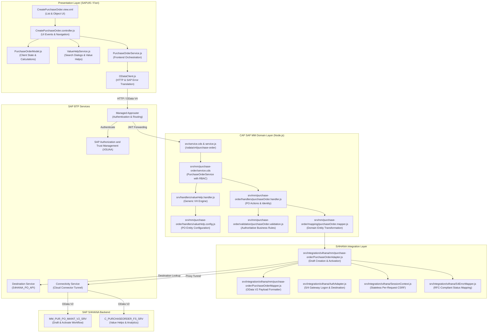

# SAP S/4HANA Procurement Workspace

[](https://cap.cloud.sap)
[](https://ui5.sap.com)
[](https://sap.github.io/cloud-sdk/)
[](https://help.sap.com/docs/BTP)
[](#testing)
[](#testing)

An enterprise-grade, full-stack procurement application integrating **SAP Fiori (SAPUI5)** with **SAP S/4HANA (Cloud / On-Premise)** through the **SAP Cloud Application Programming Model (CAP)** and **SAP Business Technology Platform (BTP)**.

The solution provides a streamlined, resilient Purchase Order creation and management workflow featuring real-time value helps, authoritative multi-tier business validation, per-request stateless CSRF session management, authenticated requisitioner resolution, and unified SAP error mapping.

---

## Architecture

The application implements a strict separation of concerns across four primary tiers:



### Architectural Principles

1. **Presentation Boundary (`app/fiori-app`)**: SAPUI5 MVC views, client-side view models, user event binding, and immediate visual feedback. Never handles raw credentials, S/4 technical mapping, or backend persistence.
2. **Domain & Orchestration Boundary (`srv/`)**: Authoritative CAP business validation, user identity resolution (`XSUAA -> CAP req.user -> business requisitioner`), and transaction orchestration.
3. **Integration Boundary (`srv/integration/s4hana/`)**: Exclusive home for S/4HANA Gateway communication, SAP OData V2 payload shaping, technical date conversion (`/Date(...)/`), zero-padded item indexing (`00010`, `00020`), and per-request stateless CSRF context.
4. **Resilience & Concurrency**: The `SessionContext` architecture ensures that CSRF tokens and HTTP session cookies are scoped strictly to individual requests, eliminating cross-request state pollution under high concurrency.
5. **Multi-Tier Validation**:
   - *Tier 1 (UI)*: Immediate user guidance and required field validation.
   - *Tier 2 (CAP)*: Authoritative business invariant validation before dispatching to S/4.
   - *Tier 3 (S/4HANA)*: Backend ERP validation (credit checks, release strategies, posting locks).

---

## Features

- **Interactive SAP Fiori Interface**:
  - Full-featured Purchase Order creation workspace built with responsive SAPUI5 design.
  - Dynamic line item table: Add, duplicate, delete items, with automatic sequence renumbering (`10`, `20`, `30`...).
  - Real-time gross and net value calculation with multi-currency support.
- **Comprehensive S/4HANA Value Helps**:
  - Live search and selection dialogs directly querying SAP Gateway catalogs (`C_PURCHASEORDER_FS_SRV`).
  - Available for **Suppliers**, **Plants**, **Storage Locations**, **Materials**, **Purchasing Organizations**, **Purchasing Groups**, **Incoterms**, and **Payment Terms**.
- **Two-Phase Transactional S/4HANA Processing**:
  - Creates a draft Purchase Order header (`C_PurchaseOrderTP`) and items (`C_PurchaseOrderItemTP`) against `MM_PUR_PO_MAINT_V2_SRV`.
  - Executes explicit draft activation (`ActivateDraftPurchaseOrder`) to commit clean, persistent S/4 documents.
- **Dynamic Requisitioner Identity Resolution**:
  - Automatically derives requester identity from authenticated XSUAA credentials (`req.user.id` / `req.user.attr.name`), falling back cleanly to business defaults only when running unauthenticated local mocks.
- **Unified SAP Error Model**:
  - Converts complex SAP Gateway error XML/JSON messages into standard RFC HTTP status codes:
    - `400 Bad Request` — malformed input or missing structural attributes.
    - `401 Unauthorized` — expired or invalid Gateway credentials.
    - `403 Forbidden` — missing SAP authorization object or CSRF rejection.
    - `404 Not Found` — missing supplier, material, or service endpoint.
    - `409 Conflict` — document locked by another SAP user or process.
    - `422 Unprocessable Entity` — S/4HANA business validation rejection.
    - `502 / 503 Bad Gateway` — S/4HANA or Cloud Connector communication failure.
    - `500 Internal Error` — unexpected runtime exception.
- **Modular Frontend Controller Pattern**:
  - Clean separation into `CreatePurchaseOrder.controller.js` (UI lifecycle), `PurchaseOrderModel.js` (state), `ValueHelpService.js` (dialogs), `PurchaseOrderService.js` (orchestration), and `ODataClient.js` (HTTP & error parsing).

---

## Technology Stack

| Layer | Technology / Library | Version | Purpose |
| :--- | :--- | :--- | :--- |
| **Frontend** | SAPUI5 | 1.120+ | Responsive SAP Fiori UX and control library |
| **Frontend Tooling** | `@ui5/cli`, `@ui5/linter` | 4.x / 1.x | UI5 local server, build packaging, and static analysis |
| **Backend Framework** | SAP Cloud Application Programming (CAP) | Node.js `@sap/cds` v10 | OData V4 service model, routing, and business logic |
| **SAP Integration** | SAP Cloud SDK | v4.x | BTP Destination lookup, HTTP client, resilience, and retry |
| **Local Persistence** | `@cap-js/sqlite` | 3.x | Lightweight local SQLite database for mock testing |
| **Security & Auth** | SAP XSUAA (`@sap/xssec`, Approuter) | Dedicated | OAuth 2.0 JWT validation, RBAC, and route authentication |
| **Deployment / MTA** | Cloud MTA Build Tool (`mbt`) | 1.2+ | Multi-Target Application archive packaging for Cloud Foundry |
| **Test Suite** | Jest, `@cap-js/cds-test`, Supertest | 30.x / 1.x | Comprehensive Unit, Integration, and E2E automation |

---

## Prerequisites

Ensure the following tools and runtimes are installed on your workstation:

1. **Node.js**: `v20.x` LTS or higher (`node --version`)
2. **npm**: `v10.x` or higher (`npm --version`)
3. **SAP CAP Development Kit**:
   ```bash
   npm install -g @sap/cds-dk
   cds --version
   ```
4. **SAP UI5 CLI**:
   ```bash
   npm install -g @ui5/cli
   ui5 --version
   ```
5. **Cloud MTA Build Tool (`mbt`)**:
   ```bash
   npm install -g mbt
   mbt --version
   ```
6. **Cloud Foundry CLI**: `cf` version 8 or higher with the MTA deployment plugin (`cf add-plugin-repo CF-Community https://plugins.cloudfoundry.org && cf install-plugin multiapps`).
7. **SAP S/4HANA Access**: An active SAP S/4HANA system (Cloud or On-Premise 1909+) with OData services activated on the SAP Gateway.

---

## Local Development

### 1. Repository Setup

Clone the repository and install all required root and application dependencies:

```bash
git clone <repository-url>
cd SAPS4HANAFULLSTACK

# Install root CAP backend dependencies
npm install

# Install Fiori frontend dependencies
cd app/fiori-app && npm install && cd ../..
```

### 2. Configure Environment Variables

Create your local environment file from the sanitized template:

```bash
cp .env.example .env.local
```

Edit `.env.local` to configure your target S/4HANA development Gateway:

```properties
S4_SYSTEM_NAME=S4HANA_DEV
S4_DESTINATION_URL=https://s4hana.your-company.com:44300
S4_CLIENT=220
S4_CONNECTION_TYPE=abap_catalog
S4_USERNAME=<your-s4-username>
S4_PASSWORD=<your-s4-password>
PORT=4004
NODE_ENV=development
```

> [!NOTE]
> `.env.local` is ignored by git to protect your credentials. Never commit real credentials or private keys.

### 3. Running the Application

#### Option A: Full-Stack CAP Watch (Recommended)
Runs the CAP backend with auto-reload, serving both the OData V4 services and the Fiori application:

```bash
npm start
# or
npx cds watch
```

- **CAP Service Home & Test Launchpad**: [http://localhost:4004](http://localhost:4004)
- **Fiori Purchase Order Application**: [http://localhost:4004/fiori-app/webapp/index.html](http://localhost:4004/fiori-app/webapp/index.html)
- **OData V4 Purchase Order Metadata**: [http://localhost:4004/odata/v4/purchase-order/$metadata](http://localhost:4004/odata/v4/purchase-order/$metadata)

#### Option B: Standalone UI5 Development Server
To work strictly on frontend SAPUI5 views with UI5 tooling:

```bash
cd app/fiori-app
npm start
```

---

## S/4HANA Configuration

To connect this application to an SAP S/4HANA system, ensure the following backend components are configured:

### 1. Required OData Services

Activate the following Gateway services in transaction `/IWFND/MAINT_SERVICE`:

| Technical Service Name | Version | OData Version | ICF Node Path | Purpose |
| :--- | :--- | :--- | :--- | :--- |
| `MM_PUR_PO_MAINT_V2_SRV` | 0001 | OData V2 | `/sap/opu/odata/sap/MM_PUR_PO_MAINT_V2_SRV` | Purchase Order Draft creation, item maintenance, and document activation |
| `C_PURCHASEORDER_FS_SRV` | 0001 | OData V2 | `/sap/opu/odata/sap/C_PURCHASEORDER_FS_SRV` | Value helps (Suppliers, Plants, Storage Locations, Materials) & analytics |

Ensure system aliases are assigned (`LOCAL` or target S/4 backend RFC destination) and ICF nodes are active in transaction `SICF`.

### 2. Required SAP Authorizations

The technical integration user (or authenticated end user when using Principal Propagation) requires the following authorization objects:

- `M_BEST_BSA`: Purchase Order Document Types (e.g. `NB`)
- `M_BEST_EKG`: Purchasing Groups
- `M_BEST_EKO`: Purchasing Organizations
- `M_BEST_WRK`: Plants
- `S_SERVICE`: Gateway Service authorization for `MM_PUR_PO_MAINT_V2_SRV` and `C_PURCHASEORDER_FS_SRV`

### 3. SAP Cloud Connector (On-Premise Only)

When connecting SAP BTP to an On-Premise SAP S/4HANA system:

1. In the **SAP Cloud Connector** admin console, create a mapping under your BTP Subaccount:
   - **Backend Type**: `ABAP System`
   - **Protocol**: `HTTPS` (or `HTTP`)
   - **Internal Host**: `<internal-s4-host>` : `<internal-port>`
   - **Virtual Host**: `s4hana.virtual.internal` : `443`
2. Configure **Accessible Resources**:
   - Path: `/sap/opu/odata/sap/MM_PUR_PO_MAINT_V2_SRV` → **Path and all sub-paths** (Enabled)
   - Path: `/sap/opu/odata/sap/C_PURCHASEORDER_FS_SRV` → **Path and all sub-paths** (Enabled)

---

## BTP Configuration

The multi-target application relies on managed BTP Cloud Foundry backing services declared in `mta.yaml`:

### 1. Managed Services

- **`saps4hana-auth`** (`xsuaa` / `application`): Secures endpoints with OAuth 2.0 and provisions application roles configured via `xs-security.json`.
- **`saps4hana-destination`** (`destination` / `lite`): Resolves S/4HANA destination targets at runtime.
- **`saps4hana-connectivity`** (`connectivity` / `lite`): Handles secure SOCKS5 proxy tunneling via Cloud Connector.
- **`saps4hana-html5-repo-host`** & **`saps4hana-html5-runtime`** (`html5-apps-repo`): Stores and serves compiled SAPUI5 frontend assets.
- **`saps4hana-approuter`** (`approuter.nodejs`): Central entry point handling session cookies, CSRF protection, and reverse proxy routing.

### 2. Destination Service Configuration (`S4HANA_PO_API`)

In your BTP Subaccount under **Connectivity → Destinations**, configure destination `S4HANA_PO_API`:

```properties
Name=S4HANA_PO_API
Type=HTTP
URL=https://s4hana.virtual.internal:443
ProxyType=OnPremise
Authentication=BasicAuthentication
User=<S4HANA_INTEGRATION_USER>
Password=<S4HANA_INTEGRATION_PASSWORD>
HTML5.DynamicDestination=true
WebIDEUsage=true
WebIDESystem=S4HANA
sap-client=220
```

> [!TIP]
> For production enterprise setups, replace `BasicAuthentication` with `PrincipalPropagation` and configure X.509 user mapping in the SAP Cloud Connector.

---

## Environment Variables

| Variable | Scope | Required | Default | Description |
| :--- | :--- | :--- | :--- | :--- |
| `S4_DESTINATION_URL` | Local Dev | Yes | — | Base HTTP(S) Gateway URL for S/4HANA |
| `S4_CLIENT` | Local Dev | Yes | `220` | SAP Client ID |
| `S4_SYSTEM_NAME` | Local Dev | Optional | `S4HANA_DEV` | System identifier for logging |
| `S4_CONNECTION_TYPE` | Local Dev | Optional | `abap_catalog` | Connection catalog mode |
| `S4_USERNAME` | Local Dev | Yes | — | Technical user for local Gateway calls |
| `S4_PASSWORD` | Local Dev | Yes | — | Technical user password |
| `PORT` | Local Dev | No | `4004` | Local CAP web server port |
| `NODE_ENV` | All | No | `development` | Runtime environment (`development`, `production`, `test`) |

> [!IMPORTANT]
> When deployed to SAP BTP Cloud Foundry, credentials are never read from `.env` files. BTP automatically injects destination and connectivity credentials through `VCAP_SERVICES`.

---

## Testing

The project maintains a rigorous, multi-layered automated test suite ensuring high reliability across all domain mappers, handlers, S/4 adapters, and Fiori workflows.

### Running Test Commands

```bash
# Run all test suites (Unit, Integration, E2E)
npm test

# Run isolated unit tests
npm run test:unit

# Run S/4 integration tests with mock fixtures
npm run test:integration

# Run end-to-end simulated Purchase Order flows
npm run test:e2e

# Run UI5 static code linter
cd app/fiori-app && npm run lint

# Validate MTA deployment descriptor
npm run validate:mta
```

### Test Coverage Summary (18 Suites, 116 Tests)

- **Unit Tests (`test/unit/`)**:
  - `authAdapter.test.js`: S/4HANA Gateway credential validation, Cloud SDK HTTP execution, and Destination resolution.
  - `errorMapping.test.js`: Semantic SAP Gateway error code mapping (400, 401, 403, 404, 409, 422, 502, 503, 500).
  - `sessionContext.test.js`: Concurrency isolation for per-request CSRF and session cookies.
  - `purchase-order/validation.test.js`: Authoritative header and line item validation rules.
  - `purchase-order/domainMapping.test.js`: CAP domain entity normalization and defaulting.
  - `purchase-order/payloadMapping.test.js`: S/4HANA OData V2 structure translation and field mappings.
  - `purchase-order/userIdentity.test.js`: Authenticated requisitioner derivation and production security isolation.
  - `purchase-order/dateConversion.test.js`: OData `/Date(epoch)/` timestamp conversions.
  - `purchase-order/quantityConversion.test.js`: Numeric quantity and price formatting.
  - `purchase-order/itemNumbering.test.js`: Standard 10-increment line item sequence formatting (`00010`, `00020`).
- **Integration Tests (`test/integration/purchase-order/`)**:
  - `authorization.test.js`: Role-Based Access Control (RBAC) tests for Viewer, PurchasingManager, and Anonymous.
  - `createPurchaseOrder.test.js`: Two-phase end-to-end draft and activation orchestration with error classifications.
  - `draftCreation.test.js`: S/4 draft header and item generation via `C_PurchaseOrderTP`.
  - `activation.test.js`: Draft activation function import orchestration via `C_PurchaseOrderTPActivation`.
  - `s4Read.test.js`: Purchase order query and key read operations.
  - `valueHelps.test.js`: Entity routing and deduplication for Suppliers, Materials, Plants, and Currencies.
  - `metadata.test.js`: S/4 EDMX metadata validation and OData V4 service contract verification.
- **End-to-End Tests (`test/e2e/purchase-order/`)**:
  - `createPurchaseOrderFlow.test.js`: Full 7-step user journey simulation from Fiori HTTP payload to activated S/4 Purchase Order.

---

## Deployment

### Multi-Target Application (MTA) Packaging

The project packages into a standard Cloud Foundry MTA archive for automated deployment.

```bash
# 1. Validate MTA descriptor syntax
npm run validate:mta

# 2. Build the production MTA archive
npm run build:mta
```

This compiles the CAP Node.js service into `gen/srv/`, builds optimized SAPUI5 assets (`dist/`), and outputs `mta_archives/SAPS4HANAFULLSTACK_1.0.0.mtar`.

### Deploying to SAP BTP Cloud Foundry

```bash
# Log in to target BTP Cloud Foundry org and space
cf login -a https://api.cf.<region>.hana.ondemand.com -o <your-org> -s <your-space>

# Deploy MTA archive
cf deploy mta_archives/SAPS4HANAFULLSTACK_1.0.0.mtar
```

### Environment-Specific MTA Extensions

For deploying to staging or production environments with distinct destination names or URL hosts:

```bash
mbt build -e mta/extensions/prod/saps4hana-prod.mtaext
cf deploy mta_archives/SAPS4HANAFULLSTACK_1.0.0.mtar
```

---

## Troubleshooting

| Symptom / Error | Root Cause | Resolution |
| :--- | :--- | :--- |
| **`403 Forbidden` / `CSRF token validation failed`** | Stale or missing CSRF token during S/4 `POST` call. | Verify `SessionContext.js` is utilized. The adapter automatically issues a pre-flight `HEAD`/`GET` request with `x-csrf-token: fetch` before mutative calls. Verify ICF service allows token fetching. |
| **`502 Bad Gateway` / `S4HANA_PO_API unreachable`** | Cloud Connector tunnel closed or host mapping misconfigured. | Verify Cloud Connector status in BTP Cockpit under **Connectivity → Cloud Connectors**. Ensure the virtual host matches the destination URL exactly. |
| **`401 Unauthorized` on S/4 Gateway** | Invalid technical credentials or expired password. | Check `S4_USERNAME` and `S4_PASSWORD` in `.env.local` (local) or Destination configuration in BTP Cockpit (cloud). Verify account is not locked in SAP transaction `SU01`. |
| **`422 Unprocessable Entity`** | SAP business validation failure (e.g. material locked, plant does not exist). | Inspect the response body. `S4ErrorMapper.js` extracts structured SAP message details containing exact error codes and parameter descriptions from the Gateway. |
| **`404 Component-preload.js not found` (Local Dev)** | Normal behavior in development mode when running against unbuilt UI5 source files. | Safe to ignore during local development. In production, `ui5 build` automatically generates the preload bundle. |
| **`mbt validate` fails with schema error** | Outdated Cloud MTA Build Tool. | Update `mbt` via `npm install -g mbt` or verify `_schema-version: "3.3.0"` in `mta.yaml`. |

---

## Security

- **Zero Hardcoded Secrets**: No credentials, private keys, or passwords are stored in Git. Local configurations use gitignored files (`.env.local`), and cloud environments use BTP Service Bindings.
- **Stateless Concurrency Protection**: The `SessionContext` implementation encapsulates CSRF tokens and cookies inside per-request instances, preventing token leakage between concurrent sessions.
- **Role-Based Access Control (RBAC)**: Enforced via `xs-security.json` and CAP `@requires` annotations:
  - `Viewer`: Read-only access to Purchase Orders and Value Helps.
  - `PurchasingManager`: Authorization to create and activate Purchase Orders.
- **Sanitized Error Payloads**: Technical stack traces, backend hostnames, and internal SAP system IDs are sanitized before responding to the client.
- **Principal Propagation**: Fully compatible with SAP BTP Principal Propagation to preserve user auditing end-to-end into SAP S/4HANA `CDHDR` / `CDPOS` change documents.

---

## Project Structure

```text
SAPS4HANAFULLSTACK/
├── .env.example                          # Sanitized environment variable template
├── .gitignore                            # Excludes secrets, logs, node_modules, and build artifacts
├── AGENTS.md                             # Full-stack engineering instructions & workflow rules
├── README.md                             # Repository technical documentation
├── WORKSTATUS.md                         # Single source of truth for work logs & validation
├── jest.config.js                        # Jest configuration
├── mta.yaml                              # Multi-Target Application deployment descriptor
├── package.json                          # CAP backend scripts, Cloud SDK dependencies & auth profiles
├── server.js                             # CAP bootstrap, destination registration & local dev handlers
├── xs-security.json                      # Canonical XSUAA security roles & OAuth2 configuration
│
├── app/
│   ├── fiori-app/                        # SAP Fiori (SAPUI5) Presentation Layer
│   │   ├── package.json                  # UI5 tooling scripts (start, build, lint)
│   │   ├── ui5.yaml                      # UI5 server and build configuration
│   │   ├── xs-app.json                   # UI5 standalone route descriptor (XSUAA & CSRF)
│   │   └── webapp/
│   │       ├── Component.js              # SAPUI5 component lifecycle & route guards
│   │       ├── index.html                # Application launchpad page
│   │       ├── manifest.json             # Fiori application descriptor & MM route navigation
│   │       ├── controller/               # Shared Application Shell Controllers
│   │       │   ├── App.controller.js     # Root shell controller
│   │       │   ├── BaseController.js     # Shared controller (KPI aggregation, profile, dialogs)
│   │       │   ├── Dashboard.controller.js # Workspace analytics dashboard controller
│   │       │   └── Login.controller.js   # Standalone authentication controller
│   │       ├── view/                     # Shared Application Shell Views
│   │       │   ├── App.view.xml          # Root shell view
│   │       │   ├── Dashboard.view.xml    # Workspace analytics dashboard view
│   │       │   └── Login.view.xml        # Standalone authentication view
│   │       ├── modules/                  # SAP Business Domain Modules
│   │       │   └── mm/                   # Materials Management Domain
│   │       │       └── purchase-order/   # Purchase Order Module
│   │       │           ├── controller/
│   │       │           │   ├── PurchaseOrders.controller.js # PO worklist & filtering
│   │       │           │   └── CreatePurchaseOrder.controller.js # PO creation UI logic
│   │       │           ├── model/
│   │       │           │   └── PurchaseOrderModel.js # PO client state, validation & item numbering
│   │       │           ├── service/
│   │       │           │   └── PurchaseOrderService.js # PO domain API service
│   │       │           └── view/
│   │       │               ├── PurchaseOrders.view.xml # PO list view
│   │       │               └── CreatePurchaseOrder.view.xml # PO creation form view
│   │       ├── fragment/                 # Shared Reusable XML Fragments
│   │       │   ├── PurchaseOrderDetailDialog.fragment.xml # Quick detail dialog
│   │       │   └── UserProfilePopover.fragment.xml # User profile & logout popover
│   │       ├── model/                    # Shared View Models & Formatters
│   │       │   ├── formatter.js          # Unified display formatters
│   │       │   └── models.js             # Device & layout models
│   │       ├── service/                  # Shared Frontend Infrastructure Services
│   │       │   ├── AuthService.js        # UI session presentation state manager
│   │       │   ├── ODataClient.js        # HTTP client with CSRF & transient retries
│   │       │   └── ValueHelpService.js   # Generic value help dialog manager
│   │       └── i18n/
│   │           ├── i18n.properties      # UI internationalization strings
│   │           └── i18n_en.properties   # English fallback bundle
│   └── router/                           # Managed Application Router
│       ├── package.json                  # Approuter package descriptor
│       └── xs-app.json                   # Approuter reverse proxy routing rules (XSUAA & CSRF)
│
├── config/                               # Service configuration templates
│   ├── approuter/                        # Local approuter environment config
│   │   └── default-env.json
│   ├── connectivity/                     # BTP connectivity service credentials
│   │   └── connectivity-service.json
│   └── destinations/                     # BTP destination definitions
│       └── destination-service.json
│
├── db/                                   # CDS Persistence Model
│   └── schema.cds                        # Domain models and entity definitions
│
├── srv/                                  # CAP Application Service Layer
│   ├── service.cds                       # Application facade (re-exports MM Purchase Order)
│   ├── service.js                        # Application bootstrap (delegates to MM Purchase Order)
│   ├── auth-service.cds                  # Standalone authentication service definition
│   ├── auth-service.js                   # Standalone authentication service handler
│   ├── handlers/                         # Shared Generic CAP Handlers
│   │   └── valueHelp.handler.js          # Generic value help registration engine
│   ├── mm/                               # Business Domain Services (SAP MM)
│   │   └── purchase-order/               # Purchase Order Business Service
│   │       ├── service.cds               # PO Service with authoritative RBAC annotations
│   │       ├── service.js                # PO Service implementation & handler registration
│   │       ├── handlers/
│   │       │   ├── purchaseOrder.handler.js # PO CRUD handlers, identity derivation & validation
│   │       │   └── valueHelp.config.js   # PO value help entity mappings & reader bindings
│   │       ├── mapping/
│   │       │   └── purchaseOrder.mapper.js # Domain normalization & defaulting
│   │       └── validation/
│   │           └── purchaseOrder.validation.js # Authoritative business validation rules
│   ├── integration/                      # S/4HANA Technical Integration Layer
│   │   └── s4hana/
│   │       ├── AuthAdapter.js            # Shared S/4 Gateway logon & Cloud SDK HTTP execution
│   │       ├── S4ErrorMapper.js          # Shared semantic SAP error status mapping
│   │       ├── SessionContext.js         # Shared request-isolated CSRF & cookie manager
│   │       └── mm/                       # MM Integration Adapters
│   │           └── purchase-order/       # Purchase Order S/4HANA Adapter
│   │               ├── PurchaseOrderAdapter.js # S/4HANA OData V2 draft & activation orchestration
│   │               └── PurchaseOrderMapper.js  # S/4 OData V2 payload formatter & date converter
│   └── external/                         # External S/4HANA EDMX Specifications
│       ├── C_PURCHASEORDER_FS_SRV.cds    # Purchase Order Read / Analytics service model
│       ├── C_PURCHASEORDER_FS_SRV.edmx
│       ├── MM_PUR_PO_MAINT_V2_SRV.csn    # Purchase Order Maintenance service model
│       └── MM_PUR_PO_MAINT_V2_SRV.edmx
│
├── test/                                 # Automated Test Suite (18 Suites, 116 Tests)
│   ├── unit/                             # Isolated Unit Tests
│   │   ├── authAdapter.test.js           # S/4 Gateway logon & Cloud SDK HTTP tests
│   │   ├── errorMapping.test.js          # Semantic SAP error mapping tests
│   │   ├── sessionContext.test.js        # Request-isolated session concurrency tests
│   │   └── purchase-order/               # Purchase Order Domain Unit Tests
│   │       ├── dateConversion.test.js    # OData /Date(epoch)/ conversion tests
│   │       ├── domainMapping.test.js     # Domain normalization & defaulting tests
│   │       ├── itemNumbering.test.js     # Standard 10-increment numbering tests
│   │       ├── payloadMapping.test.js    # S/4 OData V2 payload formatting tests
│   │       ├── quantityConversion.test.js# Numeric quantity & price conversion tests
│   │       ├── userIdentity.test.js      # Identity derivation & production isolation tests
│   │       └── validation.test.js        # Authoritative business validation tests
│   ├── integration/                      # Integration Test Suites
│   │   └── purchase-order/               # Purchase Order Integration Tests
│   │       ├── activation.test.js        # Draft activation function import tests
│   │       ├── authorization.test.js     # RBAC tests (Viewer, PurchasingManager, Anonymous)
│   │       ├── createPurchaseOrder.test.js # Two-phase creation & error handling tests
│   │       ├── draftCreation.test.js     # Draft header & item creation tests
│   │       ├── metadata.test.js          # EDMX metadata & contract tests
│   │       ├── s4Read.test.js            # PO query & single-key read tests
│   │       └── valueHelps.test.js        # Value help entity routing & deduplication tests
│   ├── e2e/                              # End-to-End User Journey Tests
│   │   └── purchase-order/
│   │       └── createPurchaseOrderFlow.test.js # Full 7-step PO user journey simulation
│   └── fixtures/                         # Controlled Domain Test Fixtures
│       └── purchase-order/
│           ├── activationResponse.json   # S/4 activation response payload
│           ├── draftResponse.json        # S/4 draft creation response payload
│           ├── purchaseOrders.json       # OData PO query results fixture
│           ├── s4ErrorResponses.json     # Gateway error response fixture
│           ├── validPOPayload.json       # Valid CAP PO request payload
│           └── valueHelps.json           # Value help entity fixture
│
└── mta/                                  # MTA Environment Extensions
    └── extensions/
        ├── dev/                          # Development space configuration
        │   └── dev.mtaext
        ├── test/                         # Test space configuration
        │   └── test.mtaext
        └── prod/                         # Production space configuration
            └── prod.mtaext
```

---

## License

This project is licensed under the terms specified in the repository license.
