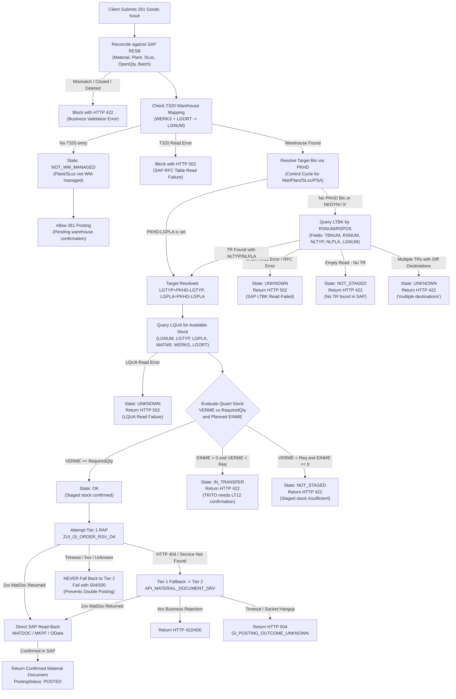

# Goods Issue Movement 261 Debugging Guide & Architecture Specification

This document details the SAP S/4HANA Movement 261 (Goods Issue for Order/Reservation) staging verification, target resolution, posting tier architecture, and troubleshooting procedures. All assertions are classified strictly as **Verified Against SAP** or **Not Verified** in compliance with repository rules.

---

## 1. Verified SAP Facts vs Not Verified Status

| Component / Table / Operation | SAP Status | Source / Evidence | Classification |
| --- | --- | --- | --- |
| `TBPE` (Transfer Requirement Item - Staging) | **Does not exist** | RFC error `DA 131` ("Table TBPE not found in ABAP Dictionary") | **Verified SAP Fact** |
| `TBPK` (Transfer Requirement Header - Staging) | **Does not exist** | RFC error `DA 131` ("Table TBPK not found in ABAP Dictionary") | **Verified SAP Fact** |
| `LTBK` (Transfer Requirement Header) | **Active & Readable** | Verified live via `RFC_READ_TABLE` (e.g. `RSNUM: 0000521169` -> `TBNUM: 0001000738`, `NLTYP: 2FL`, `NLPLA: 0001002790`) | **Verified SAP Fact** |
| `LTAK` (Transfer Order Header) | **Active & Readable** | Verified live via `RFC_READ_TABLE` | **Verified SAP Fact** |
| `LTBP` (Transfer Requirement Item) | **RFC Unreadable** | Queried via `RFC_READ_TABLE` with narrow fields `['TBNUM', 'TBPOS', 'RSNUM', 'RSPOS']` -> returned `ID:AD Type:E Number:718 LTBP` ("Table LTBP does not contain data") | **Not Verified / Restricted** |
| `LTAP` (Transfer Order Item) | **RFC Unreadable** | Queried via `RFC_READ_TABLE` with narrow fields `['TANUM', 'TAPOS', 'TBNUM', 'TBPOS']` -> returned `ID:AD Type:E Number:718 LTAP` ("Table LTAP does not contain data") | **Not Verified / Restricted** |
| `PKHD` (Control Cycle) | **Active & Readable** | `PKHD-LGPLA` verified for static staging bin; dynamic bin flag `NKDYN='X'` verified | **Verified SAP Fact** |
| `T320` (Plant/Storage Location -> Warehouse) | **Active & Readable** | Verified live via `RFC_READ_TABLE` | **Verified SAP Fact** |
| `LQUA` (Warehouse Quants) | **Active & Readable** | Verified live via `RFC_READ_TABLE` (fields `VERME`, `EINME`, `BESTQ`, `SOBKZ`, `SKZUA`) | **Verified SAP Fact** |
| `RESB` (Reservation Items) | **Active & Readable** | Verified live via `RFC_READ_TABLE` | **Verified SAP Fact** |
| `MATDOC` / `MKPF` (Material Document Read-Back) | **Active & Readable** | Verified live via `RFC_READ_TABLE` directly following goods issue posting | **Verified SAP Fact** |
| Bin derived from Order Number (`AUFNR`) | **Prohibited** | Order number is never a storage bin in SAP WM; removed heuristic lines | **Verified SAP Fact** |
| Tier 1 RAP service (`ZUI_GI_ORDER_RSV_O4`) | **Deployment / registration** | Returns 404 / `/IWFND/MED/170` on current client | **Verified SAP Fact** |
| Tier 2 OData V2 (`API_MATERIAL_DOCUMENT_SRV`) | **Posting capability** | Standard API for `A_MaterialDocumentHeader` deep insert | **Verified SAP Fact** |

---

## 2. End-to-End Decision Flowchart

---

## 3. Staging Resolution Protocol

### A. Target Bin Resolution Order
1. **Primary: Static Control Cycle (`PKHD-LGPLA`)**
   - If `PKHD` defines an explicit storage bin (`LGPLA !== ''`) and storage type (`LGTYP !== ''`), this static bin is authoritative.
2. **Secondary: Reservation Transfer Requirement (`LTBK-NLTYP` / `LTBK-NLPLA`)**
   - If `PKHD` is dynamic (`NKDYN = 'X'`), missing, or has an empty bin: Query `LTBK` directly by `RSNUM` and `LGNUM`.
   - If exactly one distinct destination `(NLTYP, NLPLA)` is found, it is adopted as the staging target.
3. **Ambiguity / Multiple Destinations**
   - If multiple open TRs exist with different destinations, return status `UNKNOWN` with error:  
     `"Cannot verify staging: multiple destinations found in transfer requirements (<destinations>)."`  
     *(Staging business block: HTTP 422)*.
4. **Prohibited Order-Number Bin Derivation**
   - **Never** derive a dynamic staging bin from an order number (`AUFNR`). Lines that generated dynamic bin strings like `000001002599` or `1002599` from order numbers have been permanently excised.

### B. 5 Staging States and HTTP Status Codes

| State | Condition | Posting Allowed? | HTTP Status Code | Description |
| --- | --- | --- | --- | --- |
| **`OK`** | `isFullyStaged: true` (`VERME >= requiredQty`) in target bin | **Yes** | 200 (on read) / Allowed | Component is fully confirmed in the staging location. |
| **`NOT_WM_MANAGED`** | No `T320` row for Plant / Storage Location | **Yes** | 200 / Allowed | Storage location is not managed by SAP WM. Posting proceeds pending warehouse confirmation. |
| **`IN_TRANSFER`** | `EINME > 0` and `VERME < requiredQty` | **No** | **422** | Stock is in transfer. Transfer order exists but is unconfirmed (requires `LT12`/`LT04` confirmation). |
| **`NOT_STAGED`** | Empty `LTBK` read (no TR), or `VERME < requiredQty` with `EINME == 0` | **No** | **422** | No stock staged and no TR, or insufficient stock in bin without open TO transfer. |
| **`UNKNOWN`** | SAP RFC table read failure (`LTBK`, `PKHD`, `LQUA`) or connectivity outage | **No** | **502** | Cannot verify SAP backend state due to communication or table read failure. |
| **`UNKNOWN`** *(Multi-Dest)* | Conflicting destinations across multiple TRs | **No** | **422** | Staging business block: ambiguous target destination. |

---

## 4. Double-Posting Prevention: Tier 1 Fallback Rule

### The Double-Posting Hazard
When the server sends a create request to SAP (Tier 1 `ZUI_GI_ORDER_RSV_O4`), network timeouts, socket hangups, or 500 errors can occur **after** SAP has committed the database Logical Unit of Work (LUW). Falling back to Tier 2 (`API_MATERIAL_DOCUMENT_SRV`) under these conditions creates a catastrophic **double posting** in SAP S/4HANA.

### Non-Negotiable Fallback Constraint
- **Allowed Fallback**: Fallback from Tier 1 to Tier 2 occurs **ONLY** on HTTP 404 / service-not-found / `/IWFND/MED/170`. This proves the RAP service is not registered/active on the Gateway hub, meaning no database commit occurred.
- **Forbidden Fallback**: Fallback is **STRICTLY FORBIDDEN** on timeouts (`ETIMEDOUT`, `ESOCKETTIMEDOUT`), connection resets (`ECONNRESET`), socket hangups, HTTP 500, 502, 503, or 504.
- **Error Behavior**: On any timeout or non-404 error, the client halts immediately, reclassifies the error with code `GI_POSTING_OUTCOME_UNKNOWN` (HTTP 504) or SAP error code, and records the attempt as `needs_attention`.

---

## 5. Troubleshooting & Debugging Playbook

### Error: HTTP 422 - "No transfer requirement found for reservation X"
- **Cause**: SAP RESB has WM staging type, but no TR was created (transaction `MF60` or `LP10` has not been run).
- **Remediation**: In SAP GUI, run transaction `MF60` or `LP10` for reservation `X` to generate the transfer requirement.

### Error: HTTP 422 - "X of Y UOM in transfer; Z confirmed in the bin. Transfer requirement needs a confirmed transfer order (LT04/LT12)"
- **Cause**: Quant has `EINME > 0`. A transfer order was generated (`LT04`) but is unconfirmed.
- **Remediation**: In SAP GUI, execute transaction `LT12` to confirm the open transfer order into the staging bin.

### Error: HTTP 422 - "Cannot verify staging: multiple destinations found in transfer requirements"
- **Cause**: Open TRs linked to this reservation specify conflicting destination storage types or bins.
- **Remediation**: Check `LT22` / `LT23` for the reservation; cancel or reassign extraneous TRs so one distinct destination exists.

### Error: HTTP 502 - "Cannot verify staging: SAP LTBK read failed (AD 718 / RFC_ERROR)"
- **Cause**: RFC connection to SAP failed, or Gateway authorization lacks permission for RFC table reading.
- **Remediation**: Check transaction `SM59` destination connectivity, RFC user authorizations (`S_TABU_DIS`, `S_RFC`), and SAP Gateway system logs (`SM21`).

### Unverified / Pending Items
- **`LTBP` and `LTAP` item-level RFC reads**: Returned `AD 718` in this client. Item-level detail reads via `RFC_READ_TABLE` remain **not verified** until table authorization or SAP test data is verified by Basis.
